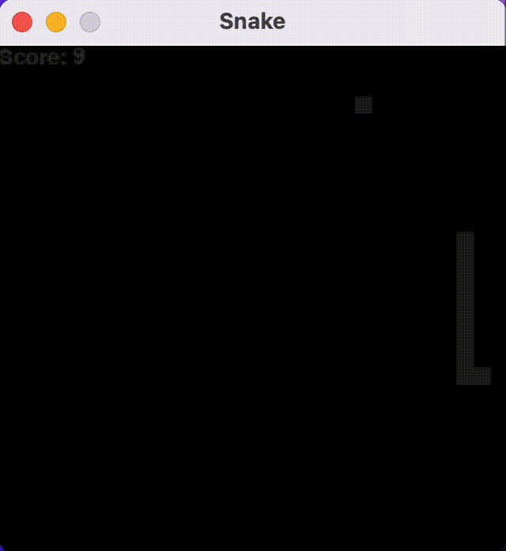
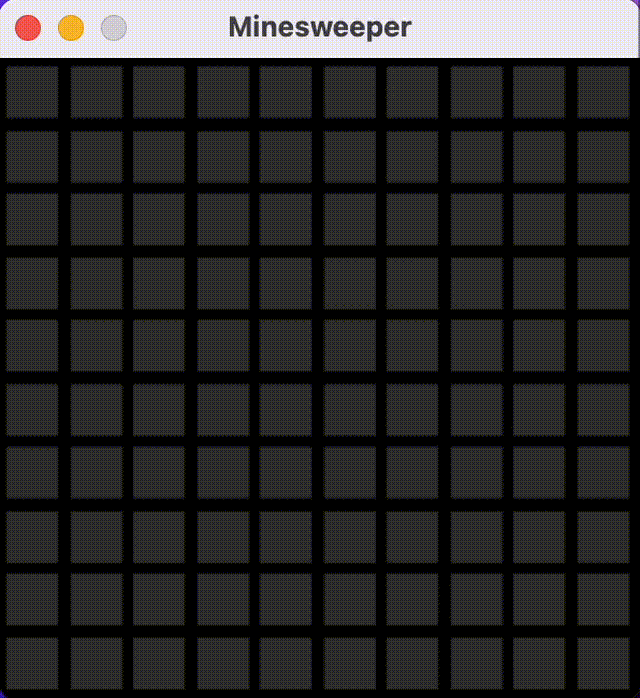

# Small Pygames

## Description

This project includes several small games written in Python that can be run directly within your code editor. They feature a dark theme and are designed to be unobtrusive. When you need a break, simply start a short game.

## Installation

1. Clone the repository.
2. Install Pygame using `pip install pygame`.

## Usage

- Game 1: Snake
    - Description: Classic snake game where the player controls a snake to eat food and grow in length.
    - Controls: 
        - Use arrow keys to control the snake's movement.
        - When game finished, press the space key.
    - Start: `python3 snake.py`
    
- Game 2: Minesweeper
    - Description: Classic Minesweeper game where the player uncovers tiles on a grid without hitting any mines.
    - Controls: 
        - Use the left mouse button to uncover a tile and the right mouse button to flag a potential mine.
        - When game finished, press the space key.
    - Start: `python3 mineswepper.py`

## Demo

  
  

## Contributing

Contributions are welcome!

## License

This project is licensed under the [MIT License](LICENSE).
